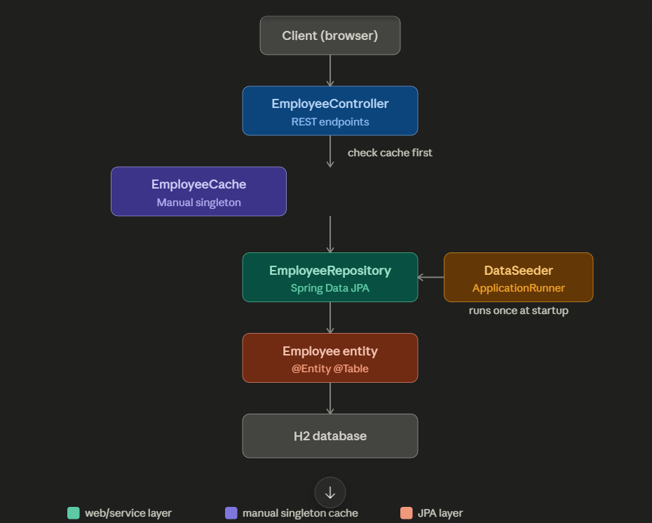
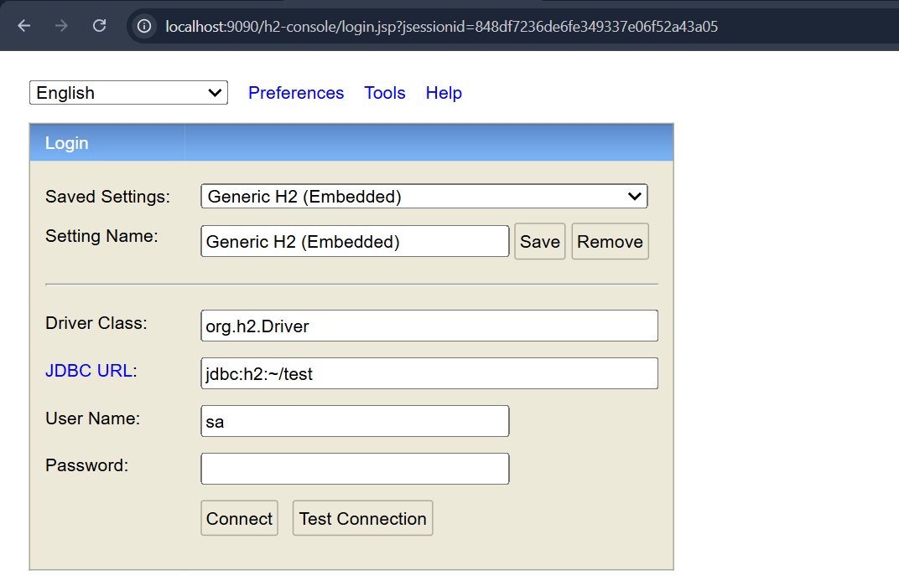
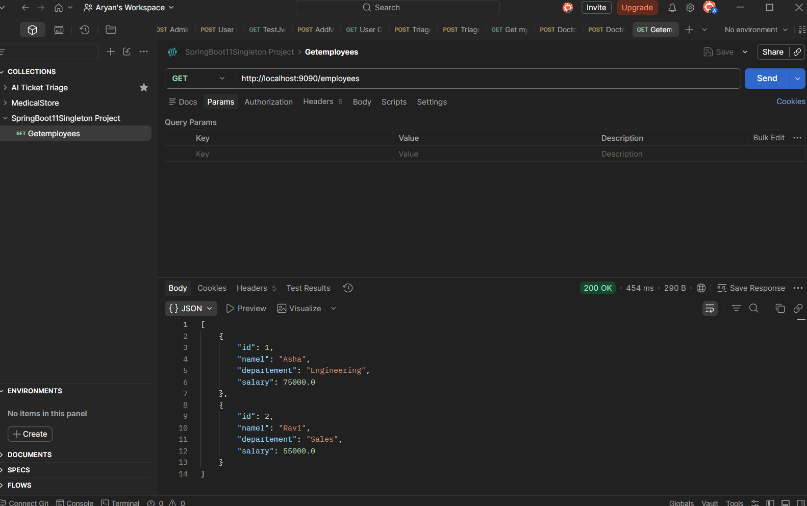
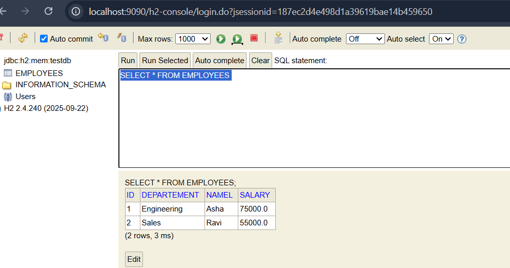
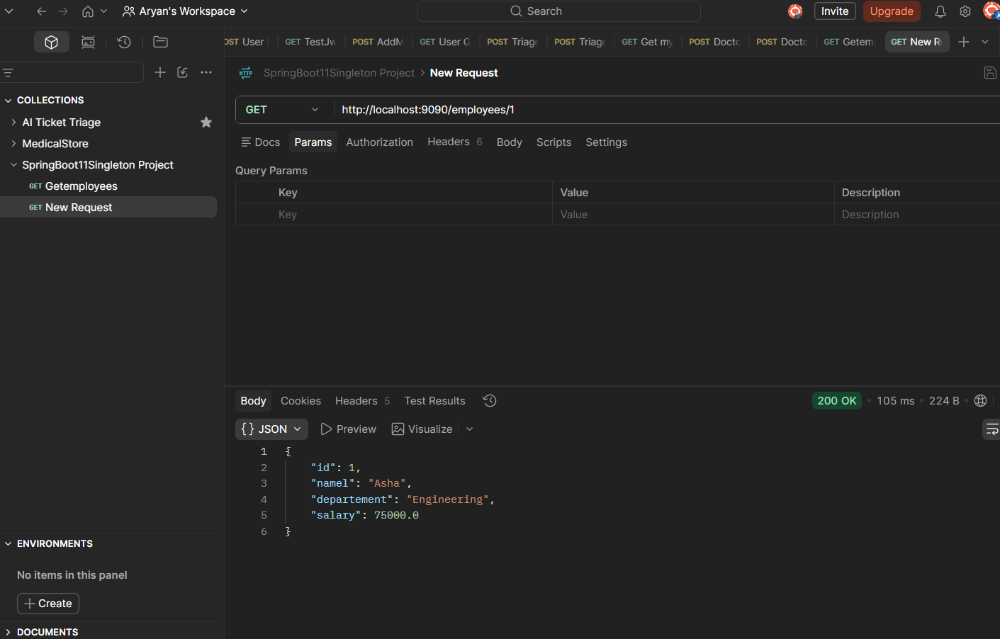

The core problem singleton solves
Some objects should exist exactly once in your application — creating multiple copies 
wastes memory, causes inconsistent state, or breaks correctness. 


  
A few notes on reading it:

Blue (EmployeeController) is your web layer — handles HTTP in/out.
Purple (EmployeeCache) is the manual singleton you built with double-checked locking — sits beside the normal flow as a shortcut.
Teal → coral → gray is the standard JPA path: repository → entity → database.
Amber (DataSeeder) is off to the side because it doesn't participate in normal requests — it only runs once when the app boots, populating the database before any client ever calls the API.

******************************************************************************************************************************************************************************************************************************


Here's the side-by-side — same behavior, wildly different amount of code.

## Manual singleton (what you built)

```java
public class EmployeeCache {

    private static volatile EmployeeCache instance;
    private final Map<Long, Employee> cache = new HashMap<>();

    private EmployeeCache() { }

    public static EmployeeCache getInstance() {
        if (instance == null) {
            synchronized (EmployeeCache.class) {
                if (instance == null) {
                    instance = new EmployeeCache();
                }
            }
        }
        return instance;
    }

    public void put(Employee e) { cache.put(e.getId(), e); }
    public Employee get(Long id) { return cache.get(id); }
}
```

Used like this — note the `getInstance()` call everywhere:
```java
Employee cached = EmployeeCache.getInstance().get(id);
EmployeeCache.getInstance().put(emp);
```

## Spring-managed singleton

```java
@Component
public class EmployeeCache {

    private final Map<Long, Employee> cache = new HashMap<>();

    public void put(Employee e) { cache.put(e.getId(), e); }
    public Employee get(Long id) { return cache.get(id); }
}
```

Used via constructor injection — no `getInstance()` anywhere:
```java
@RestController
public class EmployeeController {

    private final EmployeeCache cache;
    private final EmployeeRepository repo;

    public EmployeeController(EmployeeCache cache, EmployeeRepository repo) {
        this.cache = cache;
        this.repo = repo;
    }

    @GetMapping("/{id}")
    public Employee getById(@PathVariable Long id) {
        Employee cached = cache.get(id);
        if (cached != null) return cached;

        Employee emp = repo.findById(id).orElseThrow();
        cache.put(emp);
        return emp;
    }
}
```

## What Spring is doing behind the scenes

| Manual version                                      | Spring version                                                                                             |
|-----------------------------------------------------|------------------------------------------------------------------------------------------------------------|
| `private static volatile instance`                  | Spring's `ApplicationContext` holds the one instance internally                                            |
| `synchronized` block for thread safety              | Spring creates the bean once, at startup, before any threads touch it — no race condition possible         |
| `private` constructor + `getInstance()`             | `@Component` + constructor injection — Spring calls the constructor once and reuses that object everywhere |
| You manually call `getInstance()` at every use site | Spring hands you the *same* object automatically wherever it's a constructor parameter                     |

## Why Spring's version has no race condition

Your manual version needs double-checked locking because **any thread** could call `getInstance()` for the first time. Spring sidesteps the whole problem differently: it builds **all singleton beans upfront when the application context starts**, in a single-threaded startup phase — before your web server even accepts requests. By the time concurrent HTTP requests come in, the bean already exists. No lazy check needed, no lock needed.

## One important gotcha to know

Spring beans are singleton **by default**, but you can change that with scope:

```java
@Component
@Scope("prototype")  // now Spring creates a NEW instance every injection
public class EmployeeCache { }
```

If you ever see a bean behaving like it's not shared, check for a `@Scope` annotation — someone probably changed it away from the default.

---

Try swapping your `EmployeeCache` to the `@Component` version in your project and remove all the `getInstance()` calls — that's a good way to feel the difference directly rather than just reading about it.


*****************************************************************************************************************************************************************************************************************************************
*****************************************************************************************************************************************************************************************************************************************
*****************************************************************************************************************************************************************************************************************************************
If you want to peek inside the DB while the app is running, go to http://localhost:8080/h2-console and use:

JDBC URL: jdbc:h2:mem:testdb
Username: sa
Password: (leave blank)










Read This Notes As per classroom in Short Form...
[Java_Singleton_Notes.docx](Java_Singleton_Notes.docx)

