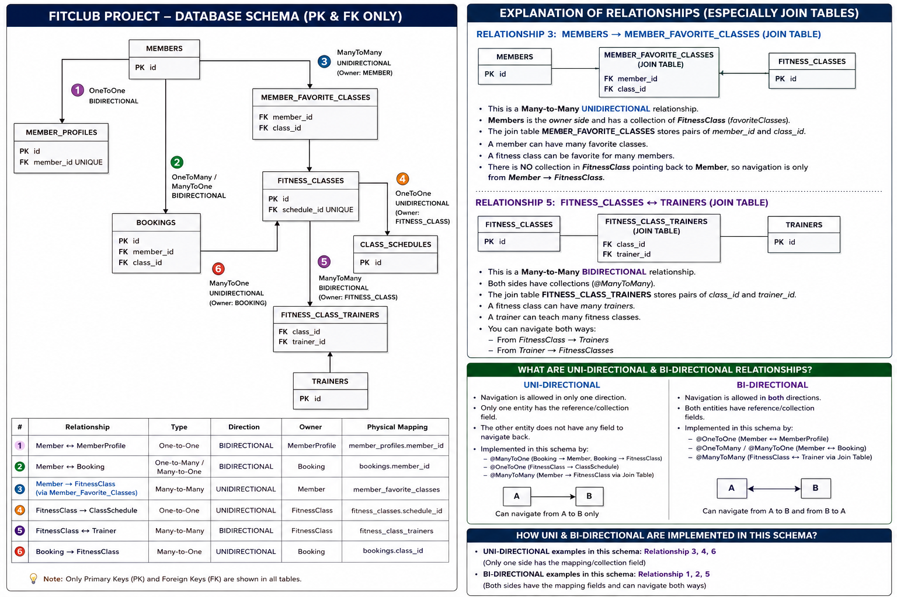

# FitClub — DB Schema Reference

Derived directly from the `@Entity` classes in
`src/main/java/com/learning/fitclub/entity/`. Use this to hand-build the
schema (MySQL Workbench, a DDL script, a migration file) independent of
letting Hibernate's `ddl-auto=update` generate it for you.

8 physical tables come from 6 entity classes — 2 of the tables
(`member_favorite_classes`, `fitness_class_trainers`) are pure join
tables with no corresponding Java class at all; Hibernate generates them
from `@ManyToMany` + `@JoinTable` alone.

---

## 1. `members` — entity: `Member.java`

| Column | Type | Constraints |
|---|---|---|
| `id` | `BIGINT` | PK, auto-increment (`GenerationType.IDENTITY`) |
| `username` | `VARCHAR(30)` | `NOT NULL`, `UNIQUE` |
| `email` | `VARCHAR(255)` | `NOT NULL`, `UNIQUE` |
| `password` | `VARCHAR(255)` | `NOT NULL` |
| `registered_on` | `DATETIME` | `NOT NULL` |

No FK columns on this table itself — every relationship Member
participates in either has the FK on the *other* table, or is the
inverse (`mappedBy`) side.

## 2. `member_profiles` — entity: `MemberProfile.java`

| Column | Type | Constraints |
|---|---|---|
| `id` | `BIGINT` | PK, auto-increment |
| `bio` | `VARCHAR(500)` | nullable |
| `phone_number` | `VARCHAR(20)` | nullable |
| `address` | `VARCHAR(200)` | nullable |
| `member_id` | `BIGINT` | FK -> `members.id`, `NOT NULL`, **`UNIQUE`** |

The `UNIQUE` on `member_id` is what makes this a true one-to-one instead
of secretly behaving like many-to-one.

## 3. `fitness_classes` — entity: `FitnessClass.java`

| Column | Type | Constraints |
|---|---|---|
| `id` | `BIGINT` | PK, auto-increment |
| `class_name` | `VARCHAR(60)` | `NOT NULL` |
| `description` | `VARCHAR(500)` | nullable |
| `capacity` | `INT` | `NOT NULL` |
| `schedule_id` | `BIGINT` | FK -> `class_schedules.id`, **`UNIQUE`**, nullable |

## 4. `class_schedules` — entity: `ClassSchedule.java`

| Column | Type | Constraints |
|---|---|---|
| `id` | `BIGINT` | PK, auto-increment |
| `day_of_week` | `VARCHAR(15)` | `NOT NULL` |
| `start_time` | `TIME` | `NOT NULL` |
| `end_time` | `TIME` | `NOT NULL` |

No FK column here at all — this table doesn't know `fitness_classes`
exists. The relationship is entirely owned by the other side.

## 5. `trainers` — entity: `Trainer.java`

| Column | Type | Constraints |
|---|---|---|
| `id` | `BIGINT` | PK, auto-increment |
| `name` | `VARCHAR(60)` | `NOT NULL` |
| `specialization` | `VARCHAR(60)` | nullable |

Also no FK column — same reasoning as `class_schedules`, just for a
many-to-many instead of a one-to-one. The relationship lives entirely in
`fitness_class_trainers` below.

## 6. `bookings` — entity: `Booking.java`

| Column | Type | Constraints |
|---|---|---|
| `id` | `BIGINT` | PK, auto-increment |
| `member_id` | `BIGINT` | FK -> `members.id`, `NOT NULL` |
| `class_id` | `BIGINT` | FK -> `fitness_classes.id`, `NOT NULL` |
| `booking_date` | `DATETIME` | `NOT NULL` |
| `status` | `VARCHAR(255)` | `NOT NULL` — stores enum name as text (`CONFIRMED`/`CANCELLED`), via `@Enumerated(EnumType.STRING)` |

## 7. `member_favorite_classes` — **no entity class** (generated from `Member.favoriteClasses`)

| Column | Type | Constraints |
|---|---|---|
| `member_id` | `BIGINT` | FK -> `members.id`, part of composite PK |
| `class_id` | `BIGINT` | FK -> `fitness_classes.id`, part of composite PK |

Pure join table for the many-to-many. Composite primary key
`(member_id, class_id)` — Hibernate enforces "no duplicate favorite" via
this composite key, not via any application code.

## 8. `fitness_class_trainers` — **no entity class** (generated from `FitnessClass.trainers`)

| Column | Type | Constraints |
|---|---|---|
| `class_id` | `BIGINT` | FK -> `fitness_classes.id`, part of composite PK |
| `trainer_id` | `BIGINT` | FK -> `trainers.id`, part of composite PK |

Same pattern as #7, one table per `@ManyToMany` relationship in the
codebase.

---

## Relationship summary table

| # | Relationship | Type | Owning side (has the FK / `@JoinTable`) | Inverse side (`mappedBy`) | FK / join table |
|---|---|---|---|---|---|
| 1 | Member ↔ MemberProfile | `@OneToOne`, **bidirectional** | `MemberProfile` (`member` field) | `Member` (`profile` field) | `member_profiles.member_id` (unique) |
| 2 | Member ↔ Booking | `@OneToMany`/`@ManyToOne`, **bidirectional** | `Booking` (`member` field) | `Member` (`bookings` field) | `bookings.member_id` |
| 3 | Member → FitnessClass (favorites) | `@ManyToMany`, **unidirectional** | `Member` (`favoriteClasses` field, owns `@JoinTable`) | *none* | `member_favorite_classes` |
| 4 | FitnessClass → ClassSchedule | `@OneToOne`, **unidirectional** | `FitnessClass` (`schedule` field) | *none* | `fitness_classes.schedule_id` (unique) |
| 5 | FitnessClass ↔ Trainer | `@ManyToMany`, **bidirectional** | `FitnessClass` (`trainers` field, owns `@JoinTable`) | `Trainer` (`classes` field) | `fitness_class_trainers` |
| 6 | Booking → FitnessClass | `@ManyToOne`, **unidirectional** | `Booking` (`fitnessClass` field) | *none* | `bookings.class_id` |

**Pattern to notice across all 6:** the entity holding `@JoinColumn` or
`@JoinTable` is always the owning side and always the one with the
physical FK column(s). `mappedBy` never adds a column — it only adds a
Java-level navigation shortcut on top of a relationship the *other* side
already fully owns at the database level.

