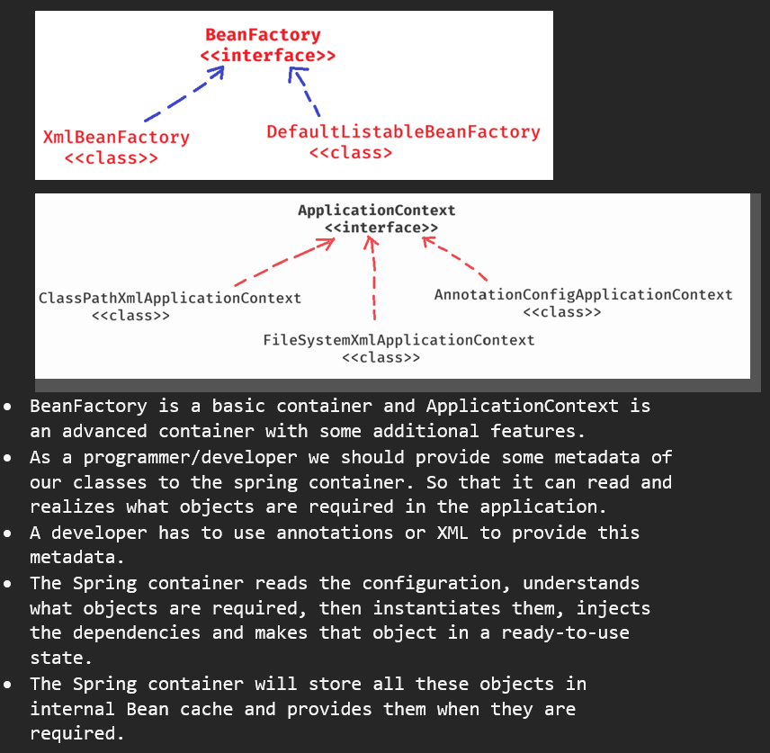
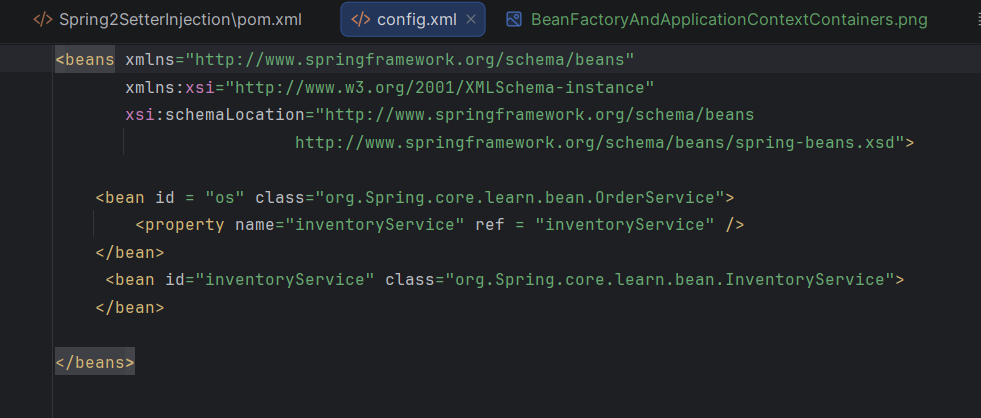

How a dependent object gets its dependency object?
•	To get a dependency object, there are two options.
•	1. dependency injection mechanism
•	2. dependency lookup mechanism
•	In Dependency Injection(DI), the dependency object will be injected to the dependent object by an external entity called container.
•	In Dependency Lookup(DL), the dependent object should contain the code for creating the dependency object, or the dependent object should lookup for the dependency object in the registry/cache.
•	In Spring framework, the Spring container injects the dependency objects to the dependent objects. So, Spring follows Dependency Injection.

Inversion of Control(IoC)?
•	IoC is a design principle which flips the normal flow of an application.
•	IoC inverts the flow of control from the application developer to the spring container/framework.
•	In a normal flow of an application, the application developer has to do the below things.
•	1. Define the classes with the “logic”.
•	2. Instantiate the classes.
•	3. Assemble the dependencies required.
•	4. Manage the objects as long as they are needed.
•	5. destroy the object, if not needed.
•	In IoC, some responsibilities are transferred to the Spring Framework.
•	A Developer has to define the classes with the “logics”.
•	The Spring IoC container will do the below things.
	1. Instantiation : creating the objects when they are needed.
•	2. Assembling:  injects the required dependencies for an object.
•	3. Managing: Keeps the objects alive as long as they are needed.
•	4. Destory : destroys the objects, when they are not needed.
•	IoC is a “design pattern” and Spring uses Dependency Injection mechanism to implement IoC principle.

Types of dependency injections:
1.	Constructor injection
2.	Setter injection
3.	Field injection
      •	In Constructor injection, the dependent class defines a constructor and the spring container injects the depedency object through that constructor.
      •	In Setter injection, the dependent class defines a setter method and the spring container injects the dependency through that setter method.
      •	In Field injection, the dependent class adds an annotation @Autowired on the dependency field, so that the spring container injects the dependency object.

