Spring-4 Annotations Notes

Annotations?
Metadata :  Data about data
How do you define the metadata?
1.	Comments
2.	Xml file
3.	Annotations
      
    •	The main purpose of annotations is to avoid/reduce writing xml file.
      •	The annotations in Java are created with the meta annotations provided by Java.
      •	The meta annotations are
      •	@Target
      •	@Retention
      •	@Repeatable, etc..
      •	@Target annotation desribes the element type of the annotation. It means, it dictates about for which type of elements this annotation can be applicable.
      
    For example:
      @Target(value = {ElementType.METHOD})
      public  @interface  Override {
      }
    
  What this mean?  The annotation is @Override and it could be used at method-level.
      
    For example:
      @Target(value = {ElementType.FIELD, ElementType.METHOD})
      Public @interface  Autowired {
      boolean required()  defaults  true;
      }
    
  What this mean? The annotation is @Autowired and it could be used at field-level or at method-level. It has an attribute “required” and its default value is true.
     
     For example:
      @Target(value={ElementType.TYPE})
      public  @interface Entity {
      }
     
 What this mean? The annotation is  @Entity and it could be used at class-level or interface-level.

    •	@Retention describes the rentention policy of annotation.
    •	RetentionPolicy  tells about how long time annotation to be retained.
    •	How long time means, is the annotation should be discarded at compile time, or it should be discarded at while loading the class into JVM or it should be retained into JVM also.
    •  	RetentionPolicy.SOURCE : The annotation should be retained in the source code file, but when it is compiled it should be discarded.
    •	RetentionPolicy.CLASS : The annotation should be retained in the source code file and also the .class file.  But it should be discarded when the class is loaded into JVM.
    •	RetentionPolicy.RUNTIME: The annotation should be retained in the source code file, .class file and also in the JVM.
For example:

    @Target(value = {ElementType.TYPE})
    @Retention(value = RententionPolicy.RUNTIME)
    Public @interface Entity {
    }

Spring annotations:
1)	@Component:
      *  It is a class-level annotation
      *  This annotation at class-level indicates that this class is a spring bean, and it should be registered in the spring container.
      * The spring framework has a feature called “component scanning”.  In this feature, When you specify the base package name, the spring will enter into that package and also will enter into the subpackages of that package, and then spring will search for the beans and will register them in the spring container.
      * During this scanning, Spring will look for @Component annotation at the class-level, to identify that class as a spring bean.
      * The spring registers a bean with its  ClassName in camelcase as id, by default.

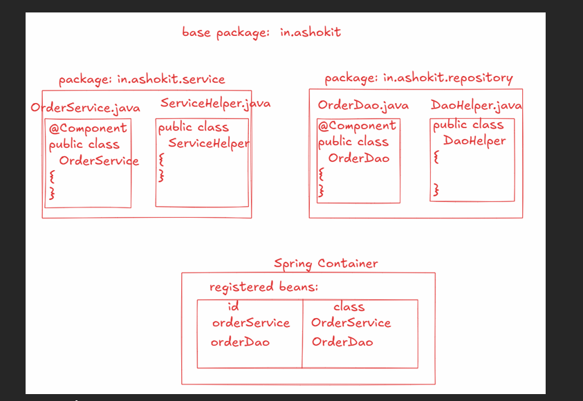

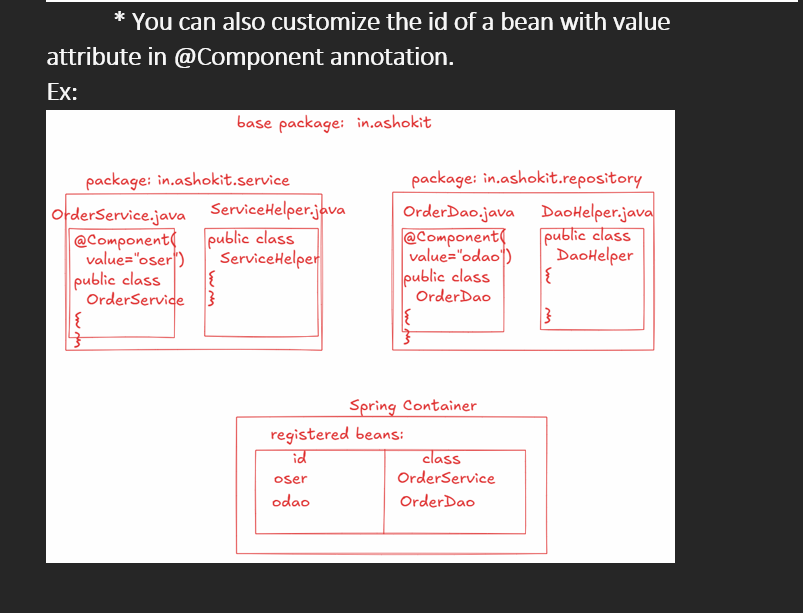

2)	@Service :
      * It is a class-level annotation.
      * This annotation at class-level indicates that this class is a service layer/business layer component.
      * By looking at @Service annotation at class-level, one can understand that this class has business logic.
      * @Service is a child annotation of @Component.
      * During the component scanning, If a class has @Service annotation, then the spring will register that class as a bean in the spring container.
      Ex:
      @Service
      Public class OrderService {
      Public boolean createOrder() {
      //logic
      }
      }
3)	@Repository:
      * It is also a class-level annotation
      * This annotation at the class-level tells that this class contains repository logic/data access logic.
      * This @Repository annotation is a child of @Component.
      * During the component scan, spring will automcatically register the classes with @Repository annotation into the spring container.
      Note:  1. In spring framework application(without spring boot), a developer has to manually define the database operations in a class. At this class-level, @Repository annotation is used.
      2. In Spring Boot application, a developer has to define only an interface to perform the database operations. At this interface-level, @Repository annotation is used.

Ex:
@Repository
Public interface OrderRepository extends JpaRepository
{   }

4)	@Controller:
      * It is also a class-level annotation.
      * This annotation at the class-level tells that this class is a presentation layer class.
      * In the webmvc applications, we have to define a controller class to handle the http requests from the clients.
      * @Controller is also a child of @Component.
      * During component scan, the spring container will automatically register this class in the spring container.
      Ex:
      @Controller
      Public class OrderController {
      @GetMapping(value=”/index”)
      Public String  getIndexPage() {
      //code
      }
      }
5)	@RestController:
      * It is also a class-level annotation
      * This annotation at class-level tells that, this class is an API layer class.
      * API layer classes are also called REST API classes.
      * @RestController is a child of @Controller
      * During component scan, the spring will automatically register this class into the spring container.

      Ex:  
      @RestController
      public class DeliveryController {
      
      @GetMapping(value=”/deliveries”)
      Public  List<Delivery>  getDeliveries() {
            //code
      }

   
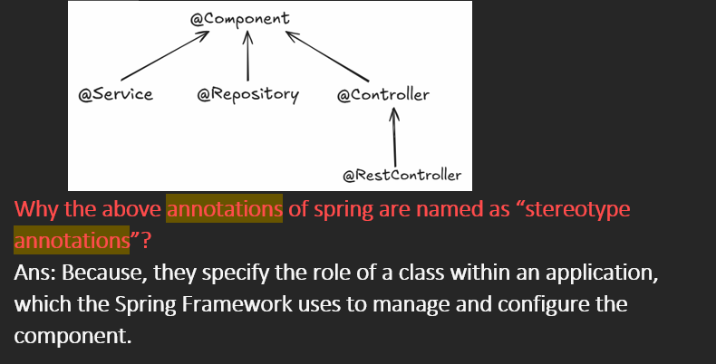

6)	@Configuration:
      * It is a class-level annotation
      * A configuration class is created to manually register the beans into a spring container.
      * In a configuration class, we can create @Bean methods.
      * @Bean annotation at the method-level tells the spring that, this method produces an object and it should be managed as a spring bean by the container.
      For example:
      @Configuration
      Public class AppConfiguration {

                 @Bean(name = “rt”)
                  Public RestTemplate  restTemplate() {
                          return new RestTemplate();
                  }
        }

      What is bean autowiring? 
      • 	Bean autowiring means,  The spring container only automatically injects the dependencies to a bean by without saying explicitly.
      •	To enable autowiring on a bean, use  autowire attribute in the <bean> tag.
      •	The values of autowire attribute are,
      •	    1. byName
      •	    2. byType
      •	    3. constructor
      •	    4. no(default)

autowire=”byName”  :      In this, the spring container matches the property name with a bean name(id), and if matched then the container injects the dependency object to that bean, via setter injection.
If not matched, then the container doesn’t inject the dependency object.

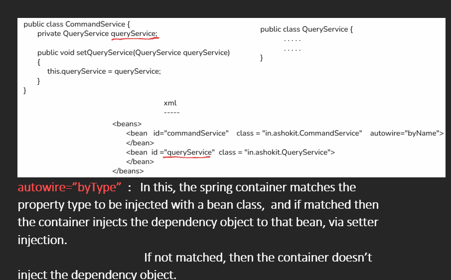

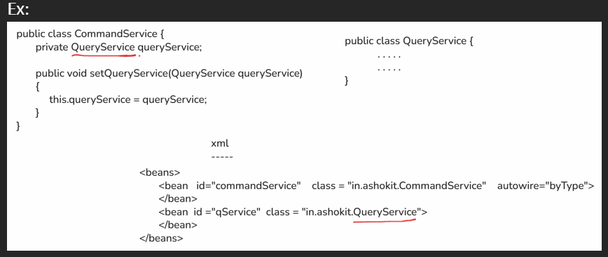

autowire=”constructor”  :   In this, the spring container matches the property type to be injected with a bean class,  and if matched then the container injects the dependency object to that bean, via constructor injection.
If not matched, then the container throws an exception.

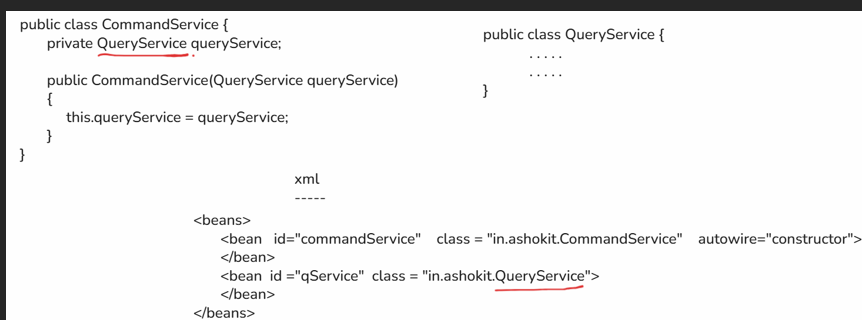

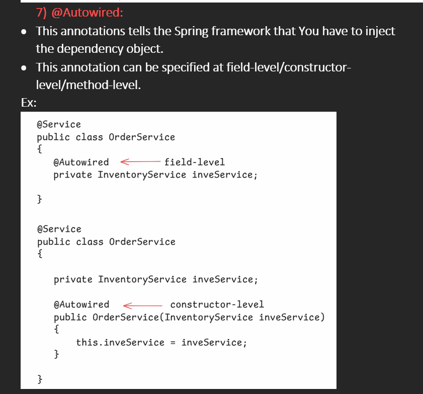   

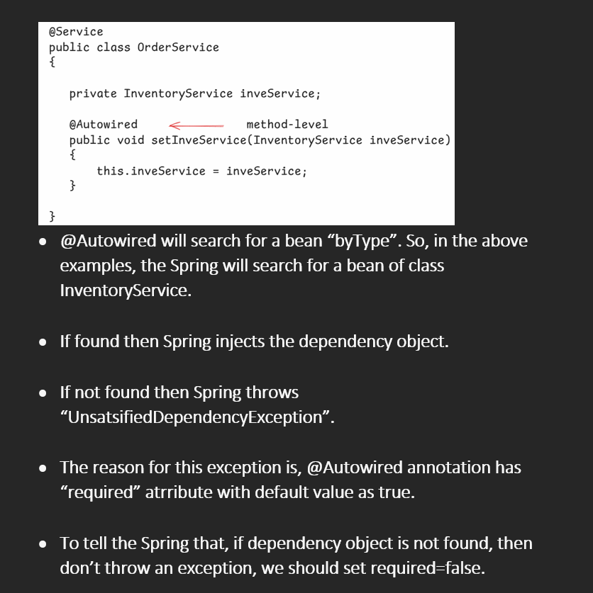

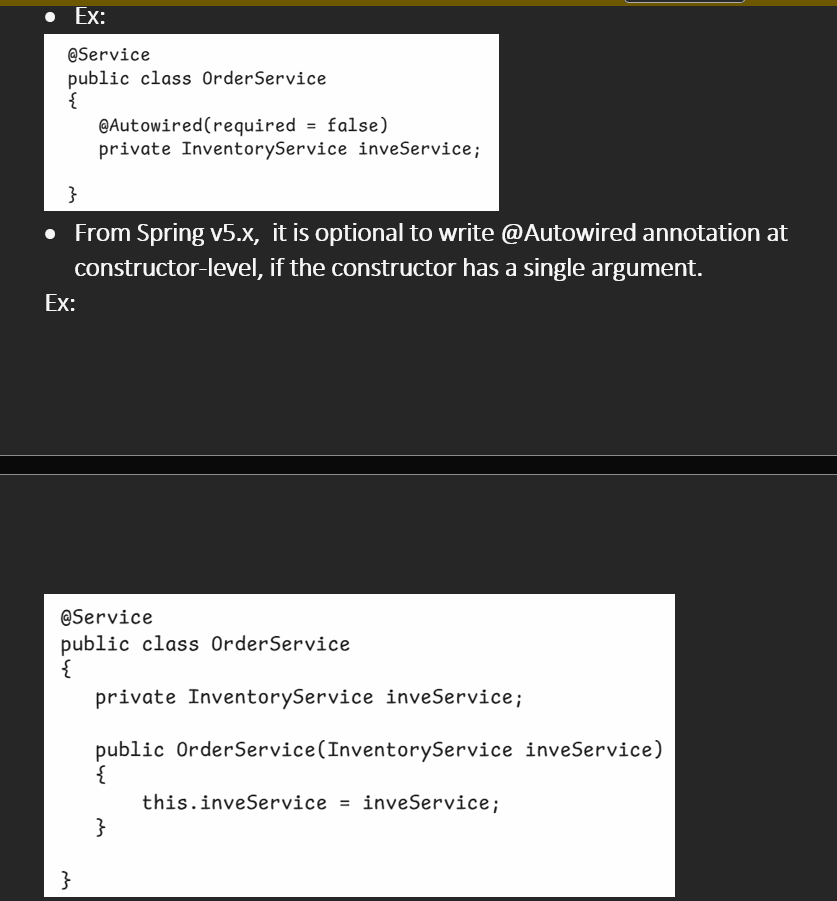

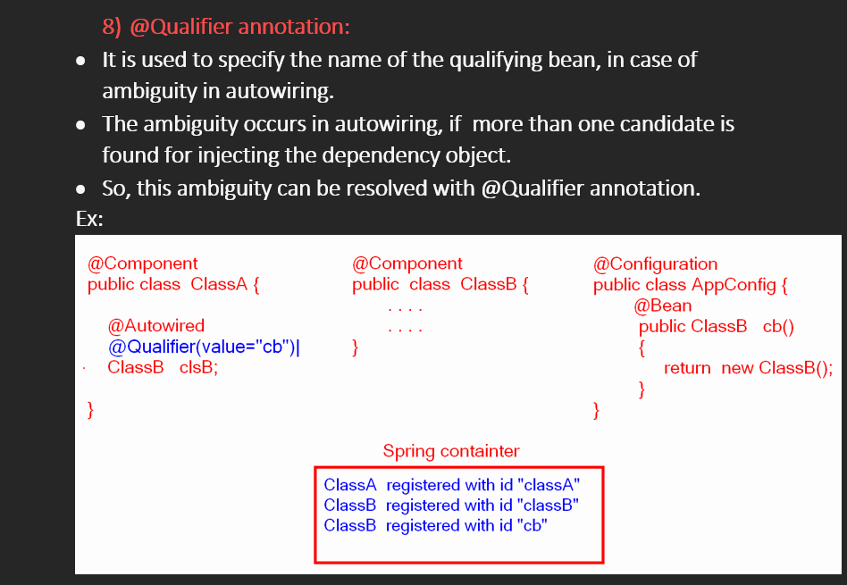

9)	@ComponentScan annotation:
      •	It is a class-level annotation, which is used to enable component scanning feature.
      
      •	To this annotation, you can specify one or more base packages.
        
      •	The sping will start the components auto scanning from the specified base packages and will also scan their sub-packages.
          
      •	This @ComponentScan annotation can be used at configuration class.

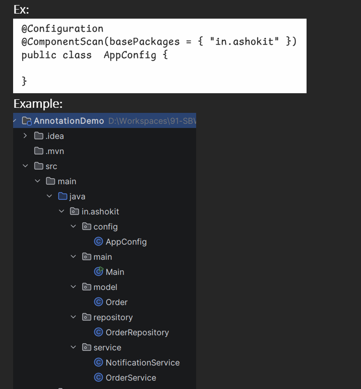

